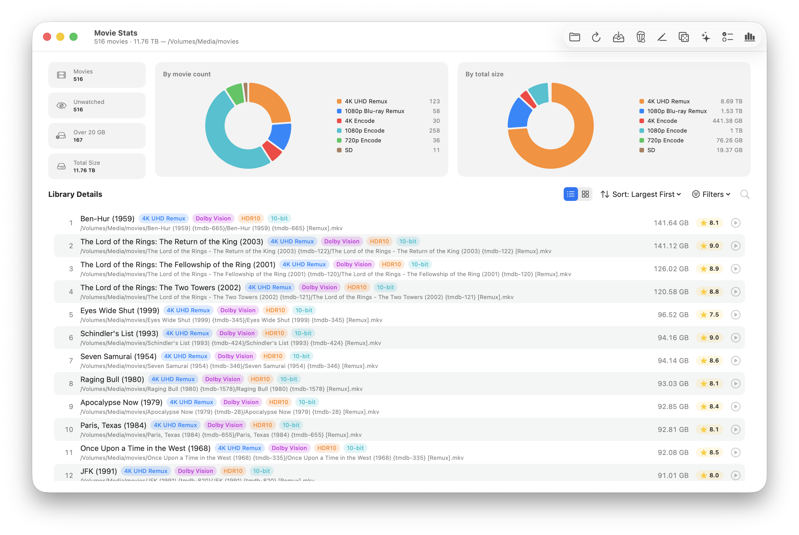

# Movie Stats

A macOS app for managing a movie library on disk — typically a
network share. Point it at a folder, and it inventories every file,
matches each to TMDB, surfaces cleanup work, renames to canonical
Plex / Jellyfin form, and imports new releases.



Library state — paths, sizes, ffprobed metadata, TMDB matches, IMDb
ratings, watch state, subtitle inventory, bonus content — lives in a
single SQLite database under `~/Library/Application Support/MovieStats/`,
so the app is instant on relaunch and queryable from the built-in
**Ask Claude** panel.

> Built for personal use. Single user, single Mac, network-attached
> storage. Ad-hoc signed, unsandboxed, not distributed.

---

## Features

- **Library overview** — totals, codec / resolution / HDR breakdowns,
  ranked list or Plex-style poster grid; filter by decade, genre,
  rating, or watch state.
- **TMDB matching** — auto-match by parsed title + year with fuzzy
  fallback, per-row manual-pick sheet, optional custom-edition label
  (`Director's Cut`, `4K77 v1.4`, etc.), poster + metadata caching.
- **Quality-aware grouping** — multiple files for the same
  `(tmdbId, edition)` slot collapse into one library row; alternate
  editions stay separate. Per-row Play menu picks the quality.
- **Canonical renaming** — rewrite files, folders, and sidecar
  subtitles to `Title (Year) {tmdb-N}/Title (Year) {tmdb-N}.ext` in
  one reviewable batch. Subs canonicalized into `Subs/`, extras into
  `Other/`, collision-safe `.N` suffixes when names clash.
- **Import wizard** — staging directory → match → cleanup → rename →
  move into library. Per-row **Replace** for files already in the
  library, per-row **Extra** for bonus videos routed into `Other/`.
- **Cleanup tools** — images, text / NFO, multi-video-per-folder, and
  empty-folder finders, each with previews and permanent-delete
  actions.
- **IMDb ratings** — bulk-loaded from IMDb's public dataset, joined
  into the library list and detail sheet.
- **Library reports** — missing English subs, upgrade candidates,
  duplicate TMDB matches, VobSub orphans, unmatched movies, space
  savers.
- **Curation** — per-movie watch state, 1–5 star personal rating,
  "Surprise Me" weighted random picker, TMDB collection
  completeness, CSV export.
- **Ask Claude panel** — natural-language queries over the SQLite
  database via the local `claude` CLI, scoped to read-only sqlite3.

---

## Quick start

**Requirements:** macOS 14+ and the Swift 6 toolchain (Xcode Command
Line Tools is enough — no full IDE).

### Run from source

```sh
swift run
```

### Bundle the release `.app`

```sh
./Tools/fetch-ffprobe.sh    # one-time: fetches a universal ffprobe binary
./build-app.sh              # produces ./MovieStats.app (ad-hoc signed)
open MovieStats.app
```

### First launch

1. Open **MovieStats → Settings…** (⌘,) and paste a TMDB API key.
2. Open a movie directory from the **Library** menu (or the toolbar's
   folder icon). The initial scan inventories every file and feeds
   them into the background `ffprobe` pass.

### Optional integrations

- [**IINA**](https://iina.io) — Play buttons route here when
  installed; otherwise the system default player handles it.
- [**`claude` CLI**](https://docs.anthropic.com/en/docs/claude-code/overview)
  — required for the Ask Claude panel. Authenticated against your
  Anthropic subscription; the panel hides itself when the binary
  isn't found.

---

## License

Personal project, no license claimed. Fork freely for your own use.
